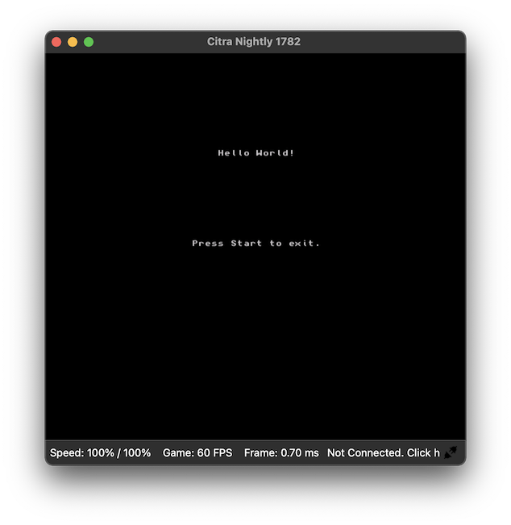
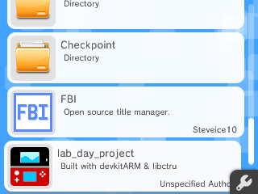
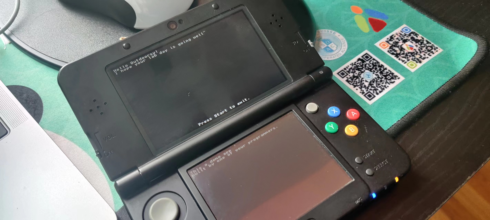
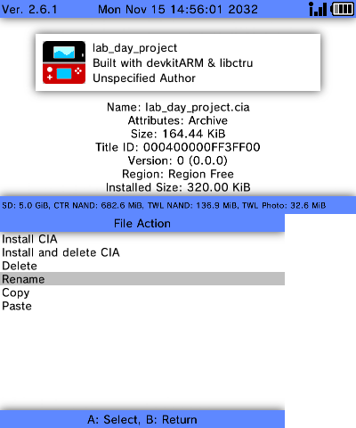
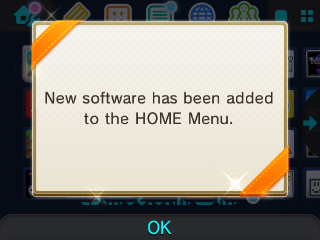

# Introduction

A couple years back I really got into [Nintendo DS homebrew development](https://github.com/jdriselvato/NDS-Development). It was very easy to break into considering the SDKs had existed for nearly a decade and emulators were near perfection. I hadn't any interest in learning 3DS homebrew development yet because Nintendo console lifecycle wasn't over. 

Earlier this year Nintendo announced that it would be closing the eshop, it's app store, March 27, 2023. and as of August 29, 2022 no one can add funds to their account to purchase from the eshop. This also meant that the 3DS would soon stop getting updates and the Nintendo Switch will be their biggest focus. I can safely say to my moral standards the lifecycle has ended.

Last month I finally decided to hack my 3DS with custom firmware and with Outdoorsy Lab day, I am finally getting a chance to mess around with homebrew development on the system. This repo is write up of the research and progress I made onf the first Lab day (Nov 16th, 2022).

NOTE: This project does presume that your 3DS/N3DS already has FBI install and CFW running. 

# Lab Day 1

## SDK installation process

I followed the instructions found here: https://devkitpro.org/wiki/Getting_Started

1. Ensured `xcode-select --install` was up to date
2. Used the pkg installer to install devkitPro pacman.
3. Use dkp-pacman to install the 3DS pacman `sudo dkp-pacman -S 3ds-dev`

To test that the SDK worked I found [this repo](https://github.com/devkitPro/3ds-examples) with 3DS examples.

I found a hello world app down in `Programming/3DS Homebrew/3ds-examples-master/graphics/printing/hello-world`, ran `make` and immediately received this error:

```
Johns-Computer:hello-world$ make
make[1]: *** ~/Programming/3DS: Is a directory.  Stop.
make: *** [all] Error 2
```

I knew it couldn't be easy. so went searching for where the install went wrong. After messing with path variables and other random ideas, I finally dug into the make file and couldn't find anything creating a random `3DS directory`. Turns out the problem is my file path has a space in it `Programming/**3DS Homebrew**/3ds-examples-master/`

So `mv "3DS Homebrew"/ 3DS_Homebrew`

and 

```
Johns-Computer:hello-world$ make
main.c
linking hello-world.elf
built ... hello-world.smdh
built ... hello-world.3dsx
```

SDK and test compiling done. phew.

## Emulating the 3DS

Now we compiled the code and made a couple of files. After looking what each one was here's a breakdown:

```
[appname].3dsx: The executable.
[appname].smdh: The icon/metadata.
```

Which meant we needed an 3DS emulator to test the executable. I could probably test it on console at this point but the moving of files between SD cards and booting the system and installing will make for a terribly slow testing process. 

The most popular 3DS emulator is [Citra](https://citra-emu.org) 

> Notice: Citra does NOT support Macs with M1 chipsets. Our Mac builds may run through Rosetta, but you WILL encounter various issues that we won't provide support for. We may eventually support M1 Macs, but not at this time.

Fortunately, I'm still running a 2017 Intel MacBook Pro but that isn't enough. Cause trying to load our hello world, I get this error:

```
Your GPU may not support OpenGL 4.3, or you do not have the latest graphics driver.
```

Turns out MacOS has support for really outdated OpenGL and latest Citra has drop compatability until further notice. The forums recommend downloading this build instead: https://github.com/citra-emu/citra-nightly/releases/tag/nightly-1782


Emulation is working on nightly-1782, nice hello world:



## Stream lining app installation

I had an idea for a program but it would require internet access. From what I've read Citra doesn't allow that, which I was able to confirm with one of the network examples. Still, maybe the console itself will work with the network code. I really don't want to have to remove the backplate (which has 2 screw) and pop out the MicroSD card each time I test code, so in this section I'm going to figure out how to stream line homebrew app installation using FBI.

FBI is an open source title manager with a bunch of features but the one I want to leverage is QR code CIA scanning. For an app/game to install on the 3DS home screen, the app must be compiled as a CIA file. At the moment our Make file only gives us a .3DSx file. We put put 3DSx files on the MicroSD card but the games wont appear on the home screen (and FBI doesn't move from LAN to the 3DS folder, so doesn't matter for us anyways). Instead we'd need to enter a homebrew booting app, which just isn't time efficent. 

So first we need a way to convert .3dsx files to .cia, when we can explore how to install the game over the network.

It looks like to convert this file we need two new toold `cxitool` and `makerom`. I found [documentation](https://gbatemp.net/threads/cxitool-convert-3dsx-to-cia-directly.440385/) describing the process but after 30 minutes, it seems this might be harder than expected.

First, these two tools aren't natively part of DevKitPro, or at least not accessibly through as seen in command line example (from gbatemp):

```
$ cxitool game.3dsx game.cxi
$ makerom -f cia -o game.cia -target t -i game.cxi:0:0
```

NOTE: The example on gbatemp was wrong and I fixed it above. They were using cxitool to convert the `.3dsx` to `.cia` but cxitool can't even do that, it only converts to `.cxi`.

We must figure out a way to either install these tools or link them as aliases to use them. Seeing that the DevKitPro [source](https://github.com/devkitPro/3dstools/tree/cxi-stuff) apparently has them, I'm not seeing them in my 3DS tool kit:

``` 
Johns-Computer:bin$ pwd
/opt/devkitpro/tools/bin

Johns-Computer:bin$ ls
3dslink*         bmp2bin*         mkbcfnt*         ndstool*         r4denc*
3dsxdump*        dlditool*        mkromfs3ds*      padbin*          raw2c*
3dsxtool*        dslink*          mmutil*          picasso*         smdhtool*
bin2s*           grit*            nds_texcompress* pkg-config*      tex3ds*
```

### Compiling cxitool

I download [cxi-stuff](https://github.com/devkitPro/3dstools/tree/cxi-stuff) and run the following to compile the tools:

```
$ ./autogen.sh
$ ./configure
$ make
```

and now we have a few new tools:

```
3dstools-cxi-stuff$ ls
3dsxdump*       ChangeLog       Makefile.in     autogen.sh*     config.log      configure.ac    missing*
3dsxtool*       INSTALL         NEWS            autom4te.cache/ config.status*  cxitool*        smdhtool*
AUTHORS         Makefile        README          compile*        config.sub*     depcomp*        src/
COPYING         Makefile.am     aclocal.m4      config.guess*   configure*      install-sh*
```

Naturally we'd want to move `cxitool` into `/opt/devkitpro/tools/bin` but I was reading that on SDK updates these folders get wiped. I did it anyways, but more of a warning.

```
$ sudo cp ./cxitool /opt/devkitpro/tools/bin/
```

So now we test converting and it works!

```
$ cxitool test.3dsx test.cia
```

### Creating a QRCode for FBI

Since `cxitool` make the cia, I don't think we need to worry about the second tool `makerom` as I don't want a `.cxi` file.

One of the most amazing features of 3DS custom firmware and the app that have been released are the ease of installing software. I must not be the only one who is annoyed with unscrewing and transfering files to the MicroSD card. Someone on the FBI team had the clever idea use the 3DS camera to use QR codes to download remote CIA files and install them directly to the device. This is how we'll quickly be able to test compiled apps on the device.

We need to build a QR Code linking to publicly hosted `.CIA` file of our app. Since we are starting to actually program something more than a Hello world, I started a project directory called `lab_day_project` that'll be referenced for the remainder of this section.

Inside `lab_day_project` we see the following:

```
$ ls
Makefile              lab_day_project.3dsx  lab_day_project.elf*  source/
build/                lab_day_project.cia   lab_day_project.smdh
```

Since this repo is hosted publicly on Github, it only makes sense to upload the .cia file of our app, and store the QR code in the same file. From there we can test installing it via FBI.

If you plan on making your own CIAs installable view QR code you'll need to approach this in two steps.

1. Upload your cia file to github
2. Create a QR Code pointing to that github direct url to the cia file.

For creating a QR Code I used https://www.thonky.com/qrcode/#qr-container

### Scanning the QRCode for FBI - attempt 1

The above steps will generate you a public facing URL to your CIA but now we must cross our fingers to see if the `CIA` file we made actually works on the 3DS. My heart is pumping cause I really don't want to spend more time building `CIA` files when at this point I could have just dragged the `3DSX` file to the MicroSD card.

I boot FBI -> Remote Install -> Camera -> Post on #mobile-team on slack for the team to cross their fingers with me -> scan the QR Code -> `Failed to install fromURL`

----

I stopped for lunch and thought it over why this might work. The lack of documentation for alot of these tools doesn't help either. But I think I must do what I've been avoiding the entire time, popping off the back plate and plugging the MicroSD into my computer. If the `.3dsx` file works natively, then we can point to the `.cia` conversion as the problem. At least now I can document running `.3dsx` files from the 3DS natively.

1. If you properly installed cfw, you should have a `/3ds/` folder on the root of your MicroSD, just drag and drop it. 
2. Boot your 3DS and open the *The homebrew launcher app* (I'm using v2.4.0)
3. scroll down to your project

Viewing the .3dsx file for the first we can learn a lot about the program. It's name, the factor it's not authorized and it has a subtext of "Built with devkitArm & libctru"

Fortunately, the 3DS with Rosaline menu allows me to take screenshots and we can see our project below:



Additionally, we can now take a screenshot of the `lab_day_project` app:



I wanted to reveal that over FBI install but at least we now know the app does work. 

### Alternative approaches to `.cia` install

#### Godmode9 - failed

So we know the app works in `.3dsx` form. Because I'm stubborn I still want to be able to install over FBI QR Code we can just let the 3DS convert it to the `.cia` for us with Godmode9.

Holding down `start` on 3DS boot will give you access to GodMode9 (if installed). From here press `home` button -> Scripts -> GM9Megascript -> Misc -> .3ds -> .cia converter

NOTE: You'll need to move the .3dsx file to root/gm9/in else the script wont know what to convert.

But after doing this I learn there's a difference between `.3dsx` and `.3ds` files, and Godmode9 only support `.3ds`.

----

#### Install from FBI directly from SD - failed

This also failed, FBI doesn't recognized the `.cia` file we made as something to install. Meaning, our converter did what?

At least now we can look `cxitool` to see of there are any options or something.


## cxitool & makerom

Never follow the tutorial of someone else without looking at the man page of the tools yourself. 

Here's the `xcitool` man page:

```
cxitool man
Usage: cxitool [options] input.3dsx output.cxi
Options:
  -n, --name=<value>      Specifies the process name of the application
  -c, --code=<value>      Specifies the product code of the application
  -t, --tid=<value>       Specifies the title ID of the application
  -s, --settings=<file>   Specifies the settings file
  -b, --banner=<file>     Specifies the banner file to embed in the CXI
  -v, --version           Displays version information
  -?, --help              Displays this text
 ```

 If you notice, the man shows `.3dsx` to `.cxi` the original poster of how to use `cxitool` mixed it.

 I found `makerom` here: https://github.com/3DSGuy/Project_CTR/releases/tag/makerom-v0.18.3

```
$ sudo cp makerom /opt/devkitpro/tools/bin/
```

Here's the `makerom` man file:

```
$ makerom
CTR MAKEROM v0.18.3 (C) 3DSGuy 2022
Built: 11:05:11 Apr 22 2022

Usage: makerom [options... ]
Option          Parameter           Explanation
GLOBAL OPTIONS:
 -help                              Display this text
 -exthelp                           Display extended usage help
 -rsf           <file>              ROM Spec File (*.rsf)
 -f             <ncch|cci|cia>      Output format, defaults to 'ncch'
 -o             <file>              Output file
 -v                                 Verbose output
 -DNAME=VALUE                       Substitute values in RSF file
NCCH OPTIONS:
 -elf           <file>              ELF file
 -icon          <file>              Icon file
 -banner        <file>              Banner file
 -desc          <apptype>:<fw>      Specify Access Descriptor template
NCCH REBUILD OPTIONS:
 -code          <file>              Decompressed ExeFS ".code"
 -exheader      <file>              Exheader template
 -romfs         <file>              RomFS binary
CIA/CCI OPTIONS:
 -content       <file>:<index>      Specify content files
 -ver           <version>           Title Version
 ```


---

It seems the [documentation](https://github.com/3DSGuy/Project_CTR/blob/master/makerom/README.md) for makerom will help us get there but the makerom example from gbatemp doesn't work. 

1. create a `.rsi` file (yaml configuration file is required for creating NCCH files)
2. create a `.cfa` file `makerom -o lab_day_project.cfa -rsf lab_day_project.rsf -target t`

Here's the real commands to convert `.3dsx` to a `.cia`

```
$ cxitool lab_day_project.3dsx lab_day_project.cxi
$ makerom -v -f cia -o lab_day_project.cia -target t -i lab_day_project.cxi:0:0 -ignoresign -icon lab_day_project.smdh
```

And it finally workes. I tested installing via FBI directly off the MicroSD card and below are some screenshots of it working:



the installation success alert



then it showing up on the home page of the 3DS


### FBI QR Code install

I couldn't let this project end without installing the app via the QR code. I think that feature is too cool. So here's a youtube video of it working:


# What I learned

Open Source homebrew tools for the 3DS are not documented very well. If anything, this project is probably going to be a massive help to community because I debugged the tools to a point that actual documentation exists. I also thought I'd be able to create a better project but who knew getting the tools working would require so much time.

I don't think I would have had a chance dig this deep on 3DS development if it wasn't for Lab day at Outdoorsy. I hope we have a second one that will allow me to maybe produce something worth playing. Still it feels great to show off a text based app all in one day.

# Resources

- Introduction link: https://xem.github.io/3DShomebrew/
- Installing the SDK: hhttps://devkitpro.org/wiki/Getting_Started
